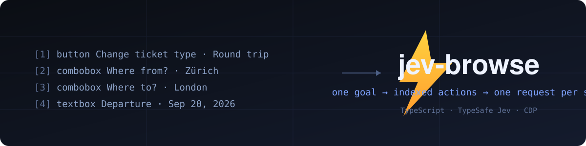

# jev-browse ⚡

**A browser agent with a dynamic, indexed action space — in TypeScript.**

Give it one goal. [TypeSafe's Jev](https://docs.typesafe.ai) picks an operation and an element. A small LLM writes text only when the operation is `TYPE_TEXT`. Ships with two interchangeable browser engines and adapters for Pi, Claude Code, OpenCode, Codex, and any MCP-capable harness.

**Zürich → London on Google Flights in 18.2 seconds.** One natural-language goal, generated city names, calendar clicks, and loading waits included.

[](docs/demo.mp4)

[Watch the MP4](docs/demo.mp4) · [Read the loop](src/agent.ts) · [Recorded with](scripts/record_demo.mjs)

## The action space

Every observation produces a new element table:

```
[1] button    Change ticket type · Round trip
[2] combobox  Where from?        · San Francisco
[3] combobox  Where to?          · empty
[4] textbox   Departure          · empty
...
```

The operations are `CLICK`, `TYPE_TEXT`, `SELECT`, `SCROLL_UP`, `SCROLL_DOWN`,
`WAIT`, `DONE`, and `BLOCKED` — plus `HOVER`, `GO_BACK`,
`GO_FORWARD`, and `PRESS_*` for Enter, Tab, Escape, Backspace, Delete, the
arrows, Home, End, PageUp/PageDown, and Space. Real key events, so command
palettes and Enter-to-submit forms work.

```
                      one Jev request
                     ┌───────────────────────────┐
page → element table → operation                 │
                     │ click_target              │
                     │ type_text_target          │
                     │ select_target, if present │
                     └─────────────┬─────────────┘
                         use the matching target
                                   │
                    CLICK [7] ─────┤──→ browser
                TYPE_TEXT [3] ─────┘
                          ↓
                   small LLM → text → browser
```

Target questions are speculative. If the operation is `CLICK`, only
`click_target` can execute. Two decisions, **one network round trip**. The
model never emits selectors, coordinates, or code, so it can't hallucinate a
target.

The extractor reads through open shadow roots and same-origin iframes
(accumulating coordinate offsets so hits land correctly), and indexes input
types a pure role-mapping would miss: `password`, `date`, `time`, `range`,
`file`. Date fields are typed key-by-key because `insertText` can't drive
them; `file` inputs are filled through `DOM.setFileInputFiles`, never clicked.
Tabs opened mid-run are adopted automatically, so `target=_blank` flows
continue.

## Try it

Requires Node ≥ 22 and Chrome.

```bash
git clone <this-repo> && cd jev-browse
npm install
node scripts/install.mjs          # pi + claude + opencode + codex
node scripts/install.mjs pi       # or one target
```

The installer esbuild-bundles every entry point into
`~/.jev-browse/install/` — a standalone copy that shares nothing with this
repo except its shape — and wires each harness:

| Harness | What it registers |
| --- | --- |
| Pi | `pi install ~/.jev-browse/install` — package with the `jev_browse` tool + skill |
| Claude Code | `claude --plugin-dir ~/.jev-browse/install`, or add to a marketplace for persistence |
| OpenCode | `opencode mcp add jev` → `node ~/.jev-browse/install/src/mcp.ts` |
| Codex | `jev-browse` entry in `~/.agents/plugins/marketplace.json` + enabled in `~/.codex/config.toml` |

Re-running the installer is idempotent and purges stale paths. To remove
everything: `node scripts/install.mjs clean`.

### Configure

```bash
TYPESAFE_API_KEY=...        # required — console.typesafe.ai/settings/keys
TYPESAFE_MODEL=jev-latest   # default
TEXT_MODEL_API_KEY=...      # required for TYPE_TEXT
TEXT_MODEL_BASE_URL=...     # OpenAI-compatible endpoint
TEXT_MODEL=...              # e.g. inception/mercury-2.5 on OpenRouter
TEXT_MODEL_REASONING=none   # some helper models reject the reasoning field
```

Keys resolve from the environment, then `.env` at the package root or the
current directory (see `.env.example`). The installed bundles also read
`~/.jev-browse/install/.env` (CLI/MCP) and
`~/.jev-browse/install/integrations/.env` (pi extension) — useful for
GUI-spawned MCP servers that don't inherit a login shell.

## Use it

```bash
npm run build   # once — tsc -> dist/ (or run src/ directly on Node ≥22.18)

node dist/cli.js --url https://www.google.com/travel/flights?hl=en \
  --goal "Find one-way flights from Zurich to London on September 20, 2026, \
for one adult in economy. Stop when matching flight options are visible." \
  [--engine cdp|agent-browser] [--headed] [--cdp http://localhost:9222] \
  [--max-steps 60] [--allow-file-urls]
```

Step events stream to stderr as JSONL; stdout carries only the final result
JSON. Exit 0 on `done`, 2 on `blocked`, 1 on error.

MCP (what the harnesses use): `node src/mcp.ts` on stdio, exposes
`jev_browse`.

Only `http(s)` start URLs are accepted — page text flows to external model
APIs, so `file://` would be an exfiltration path. Tests and fixtures opt in
with `--allow-file-urls` or `JEV_ALLOW_FILE_URLS=1`.

## Why it moves

- **One request per decision cycle.** Operation and target heads share the
  same observed state.
- **No screenshots in the agent loop.** Jev consumes structured state; the
  demo video uses a separate CDP screencast.
- **One browser call per snapshot.** `snapshot.js` reads visible controls,
  names, values, and text atomically, keeping references to real DOM nodes.
- **Freshness guards before every action.** Full marker compare for
  fill/wait/scroll/DONE; a scoped guard (document + URL + form values +
  target context) for click/select. Select evaluation failures are fatal,
  not stale.
- **Mutations never retry.** Execution is logged before the post-action
  observation. `TYPE_TEXT` values are cached only while the helper input is
  identical and discarded after a successful mutation.
- **Bounded runs.** `MAX_STEPS` actions (default 60), `2×` model calls,
  three consecutive no-change non-wait actions → `blocked`.
- **Runs serialize on a pid lock.** `~/.jev-browse/run.lock` fails fast
  instead of fighting over Chrome's SingletonLock.

## Engines

| | `cdp` (default) | `agent-browser` |
| --- | --- | --- |
| Transport | Minimal CDP client over a browser WebSocket | `agent-browser` CLI subprocesses |
| Browser | Launches Chrome, persistent `~/.jev-browse/profile`, or `--cdp` attach | Managed session, `~/.jev-browse/agent-browser-profile` |
| Input | `Input.dispatchMouseEvent`/`insertText`/key events | CLI click/fill/select/hover on tagged `data-jev-node` elements |
| Deps | Chrome only | agent-browser binary |

Both implement `BrowserDriver` (`observe / fresh / act / close`) over the
same `snapshot.js`, action space, and freshness guards. `cdp` is the default
because it won the head-to-head — same decisions, fewer wrong final states —
and because it's the only engine that pierces iframes and shadow DOM: CSS
selectors can't cross those boundaries, so the agent-browser engine filters
pierced actions out of the table rather than offer dead targets.

## Small enough to read

| File | Job |
| --- | --- |
| [src/agent.ts](src/agent.ts) | The complete loop and text-helper handoff |
| [src/snapshot.js](src/snapshot.js) | Atomic DOM snapshot, indexed controls, freshness guards |
| [src/model.ts](src/model.ts) | Dynamic operation/target heads and text generation |
| [src/questions.ts](src/questions.ts) | Model instructions |
| [src/cdp.ts](src/cdp.ts) | Chrome launch/attach, minimal CDP client, trusted input |
| [src/abrowser.ts](src/abrowser.ts) | agent-browser engine over the same driver interface |
| [src/cli.ts](src/cli.ts) | Headless entry point every adapter runs |
| [src/mcp.ts](src/mcp.ts) | stdio MCP server exposing `jev_browse` |
| [integrations/pi](integrations/pi/index.ts) | Pi extension: `jev_browse` tool + skill |
| [integrations/opencode](integrations/opencode/jev-browse.ts) | OpenCode plugin |
| [scripts/install.mjs](scripts/install.mjs) | One installer for all harnesses |
| [scripts/record_demo.mjs](scripts/record_demo.mjs) | CDP screencast recorder behind `docs/demo.*` |

## Evidence and limits

The current video is an **18,210 ms** Google Flights run. Timing starts
after initial page observation and includes model calls, generated text,
browser work, and loading waits. The final frame is a verified results page:
one-way Zürich → London on September 20, 2026, with real fares. The video
plays at 1× from CDP frame timestamps, with a ~0.8 s final hold.

Verified coverage: [`fixture-interactions.html`](fixture-interactions.html)
scores **15/16** — one fixture section per interaction class. The remaining
gap is range sliders: a click would set the value, but the model tends to
press arrow keys without focusing the slider first.

A `DONE` choice is a claim, not proof — the model can assert a goal it
didn't reach (measured on Enter-only palettes). Verify outcomes
independently. Cross-origin iframes and closed shadow roots stay opaque —
that's the DOM, not us. There's no in-page address bar, so start on the
right site (Google Flights, not google.com). No purchase or credential
guardrail exists in code; the instruction text asks the model to behave and
nothing enforces it. Scope goals accordingly.

## Development

```bash
npm run build        # tsc -> dist/
npm run typecheck    # tsc --noEmit
npm run lint         # oxlint
npm run run -- --url ... --goal ...   # tsx src/cli.ts, no build step
```

`node scripts/record_demo.mjs --url URL --goal "..."` records a run through
the fixed-port `--cdp` attach path and renders `docs/demo.mp4` +
`docs/demo.gif` at 1×. Live runs make paid API calls.

## License

MIT — see [LICENSE](LICENSE).
